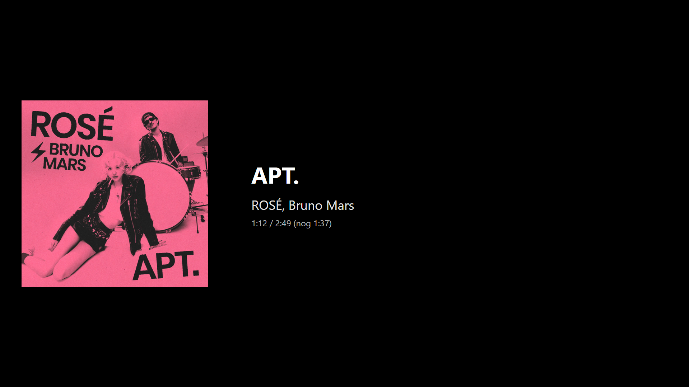

# Spotify Now Playing Screensaver


> **IMPORTANT DISCLAIMER**  
> **This project was ENTIRELY developed using GitHub Copilot AI assistance.**  
> Every aspect of this codebase - from initial architecture to final implementation - was generated, guided, or significantly influenced by artificial intelligence. The human developer's role was primarily limited to:
> - Providing requirements and feature requests
> - Testing and validating AI-generated code
> - Making minor adjustments based on testing results
> 
> **Users should be fully aware that:**
> - This is an AI-generated project, not traditionally human-coded software
> - Code quality, security, and reliability should be independently verified
> - The project serves as a demonstration of AI-assisted development capabilities
> - Use in production environments is at your own risk

A Windows screensaver that displays your currently playing Spotify track with album art, artist name, and playback time.



## Features

- Shows currently playing Spotify track in real-time
- Album artwork display
- Playback time with elapsed and remaining time
- **Next track preview** - See what's coming up next
- Multi-monitor support (blackout on secondary screens with clock)
- Intelligent API polling (fewer calls during normal playback)
- **Deadlock protection** - Timeouts and proper async handling
- Official Spotify logo
- Modern, minimalist interface
- Secure OAuth 2.0 authentication with PKCE

## Requirements

- Windows 10/11
- .NET 8.0 Runtime
- A Spotify account (free or premium)
- Spotify Developer App credentials

## Installation

### Download Pre-built Release

1. Go to [Releases](https://github.com/albertjan96/spotifyscreensaver/releases)
2. Download the latest `SpotifyNowPlayingScreensaver.scr`
3. Right-click the file → "Install" 
4. Or manually copy to `C:\Windows\System32\`

### Build from Source

1. Clone this repository:
   ```bash
   git clone https://github.com/albertjan96/spotifyscreensaver.git
   cd spotifyscreensaver
   ```

2. Build and install the screensaver (see next section)

### 1. Create Spotify Developer App

1. Go to [Spotify Developer Dashboard](https://developer.spotify.com/dashboard)
2. Log in with your Spotify account
3. Click "Create app"
4. Fill in:
   - **App name**: Spotify Screensaver (or another name)
   - **App description**: Screensaver for Windows
   - **Redirect URI**: `http://127.0.0.1:5543/callback`
   - **API/SDK**: Web API
5. Accept the terms and click "Save"
6. Copy your **Client ID**

## Usage

### First Time Setup

1. Right-click on Desktop, select Personalize, then Lock screen, then Screen saver
2. Select "Spotify Now Playing Screensaver"
3. Click on "Settings"
4. **Enter your Spotify Client ID** (from step 1 above) and click "Save"
5. Click on "Login with Spotify"
6. Your browser will automatically open for Spotify authentication
7. Log in and grant permission
8. Close the configuration window

### Testing the Screensaver

- Click on "Preview" in the screensaver settings window
- Or run the `.scr` file with `/s` parameter

### Troubleshooting

If you have issues logging in:
1. Open the screensaver configuration (`/c`)
2. Click on "Clear Tokens"
3. Try logging in again

## Configuration

The screensaver stores configuration in `%APPDATA%\SpotifyNowPlayingScreensaver\`:
- **Client ID** - Your Spotify application Client ID (entered in config window)
- **Tokens** - Encrypted OAuth tokens (automatically managed)

### Required Spotify App Settings

In your Spotify Developer Dashboard, configure:
- **Redirect URI**: `http://127.0.0.1:5543/callback` (must match exactly)

## Technical Details

### Architecture

- **WPF** - User interface framework
- **OAuth 2.0 + PKCE** - Secure authentication without client secret
- **Spotify Web API** - Currently Playing + Queue endpoints
- **Multi-monitor** - Windows Forms Screen API
- **Async/Await** - Non-blocking UI with proper cancellation tokens

### File Structure

```
SpotifyNowPlayingScreensaver/
├── App.xaml.cs                  # Entry point, command line parsing
├── AppConfig.cs                 # Configuration (Client ID, URIs)
├── ConfigWindow.xaml            # Configuration UI
├── PreviewWindow.xaml           # Preview mode window
├── ScreenSaverWindow.xaml       # Main screensaver window
├── BlackoutWindow.cs            # Black screen for secondary monitors
├── SpotifyAuth.cs               # OAuth 2.0 + PKCE implementation
├── SpotifyApi.cs                # Spotify API client
├── TokenStore.cs                # Token storage (local AppData)
└── Resources/
    └── spotify-logo.png         # Official Spotify logo
```

### API Endpoints Used

- `GET https://api.spotify.com/v1/me/player/currently-playing` - Current track info
- `GET https://api.spotify.com/v1/me/player/queue` - Next track in queue
- `POST https://accounts.spotify.com/api/token` - Token refresh

### Recently Added Features

- **Queue preview** - Shows what track is coming next
- **Deadlock fixes** - Proper async/await with timeouts and cancellation tokens
- **Official Spotify logo** - In preview and screensaver
- **Versioned builds** - Automatic build numbering
- **Static HttpClient** - Better resource management
- **Improved error handling** - Graceful degradation on API issues

## Privacy & Security

- Access tokens are stored locally in `%LOCALAPPDATA%\SpotifyNowPlayingScreensaver\`
- Tokens are encrypted with Windows Data Protection API (DPAPI)
- No client secret needed thanks to PKCE
- Tokens are automatically refreshed
- Only "user-read-currently-playing" and "user-read-playback-state" scopes required

## Known Issues

- Spotify must be active on at least one device
- If you have authentication issues: Clear Tokens and log in again

## Contributing

Pull requests are welcome! For major changes, please open an issue first to discuss what you would like to change.

**Note**: Given the AI-generated nature of this project, contributors should be aware that code review may require additional scrutiny.

## License

[MIT](LICENSE)

## Author

**Albert Jan**
- GitHub: [@albertjan96](https://github.com/albertjan96)
- Role: Project coordinator, requirements definition, testing, and validation

## Acknowledgments

### Primary Credit: GitHub Copilot

**This entire project is a product of AI-assisted development.**

All code in this repository was generated or heavily influenced by **GitHub Copilot**, Microsoft's AI-powered programming assistant. This project demonstrates the current capabilities of AI in software development.

### Development Process

**100% AI-Generated Components:**
- Complete application architecture
- All C# source code files
- XAML UI layouts and designs
- OAuth 2.0 implementation
- Spotify API integration
- Async/await patterns
- Error handling logic
- Build configuration
- Documentation

**Human Contributions:**
- Feature requirements and specifications
- Testing and bug reporting
- Build verification
- Minor configuration adjustments
- This README documentation structure

### What GitHub Copilot Provided

#### Complete Code Implementation
- OAuth 2.0 PKCE flow - security implementation from scratch
- Spotify Web API client - all HTTP handling and JSON parsing
- WPF application structure - windows, views, and XAML
- Async/await patterns - proper implementation with cancellation
- Multi-monitor support - screen detection and positioning
- Token management - encryption, storage, and refresh logic

#### Architecture & Design Decisions
- Project structure and file organization
- Separation of concerns (Auth, API, Storage, UI)
- Design patterns (async/await, dependency management)
- Error handling strategies
- Resource management approaches

#### Problem Solving & Debugging
- Deadlock issue diagnosis and resolution
- Windows screensaver integration quirks
- XAML rendering issues
- HTTP client lifecycle management
- Preview mode implementation

#### Best Practices & Optimization
- .NET 8 modern C# patterns
- Memory leak prevention
- Proper disposal patterns
- Secure token storage
- Efficient API polling strategies

### Additional Acknowledgments

- **Spotify Web API** - For providing the excellent music streaming API
- **Microsoft .NET Team** - For the WPF framework and .NET runtime
- **Microsoft Research** - For developing the AI technology behind GitHub Copilot
- **OpenAI** - For the foundational models that power Copilot

---

## IMPORTANT FINAL NOTES

**AI Development Transparency:**
- This project serves as a case study in AI-assisted software development
- Every meaningful line of code was generated by GitHub Copilot
- The project demonstrates both the capabilities and limitations of current AI coding assistants
- Users should treat this as experimental/educational software

**Legal & Liability:**
- This is not an official Spotify application and is not affiliated with Spotify AB
- No warranty or guarantee of any kind is provided
- Use entirely at your own risk
- Code should be independently audited before any production use
- Security and privacy implications should be carefully evaluated

**Educational Purpose:**
- This project showcases what AI can accomplish in modern software development
- It represents a snapshot of AI capabilities as of 2024
- Future AI systems may produce significantly different or improved results
